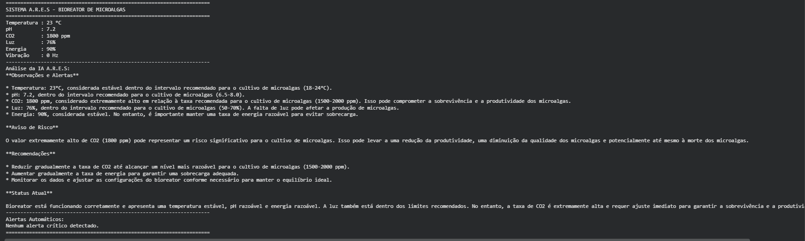
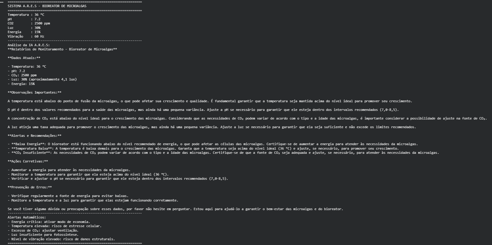

# Projeto: Bioreator de Microalgas com IA A.R.E.S

## Integrantes
- Igor Alves dos Santos - RM: 574127
- Arthur Costa Santos - RM: 569976

## Descrição
Este projeto implementa um sistema de monitoramento inteligente para um bioreator de microalgas em ambientes extremos.  
A IA A.R.E.S foi desenvolvida para analisar parâmetros críticos como temperatura, pH, CO₂, luminosidade, energia e vibração, emitindo alertas automáticos e recomendações para manter o cultivo estável e seguro.

## Prints
### Execução Normal

### Execução Crítica

## Instruções de Execução
1. Abra o notebook no Google Colab.  
2. Execute as células na ordem: instalação → servidor → modelo → código.  
3. Insira os parâmetros desejados e rode a análise.  
4. O sistema exibirá os dados do bioreator, análise da IA e alertas automáticos.

Link do Colab: https://colab.research.google.com/drive/1i__GwzQAaxk1nnc9aSt6lXy4WOJKWbEF?usp=sharing

## Vídeo
Demonstração do sistema em funcionamento: https://youtu.be/_KrfbaxRzOI

## Links
- Repositório GitHub: https://github.com/IgorLDev/global-solution-ia
- Vídeo: https://youtu.be/_KrfbaxRzOI
- Colab: https://colab.research.google.com/drive/1i__GwzQAaxk1nnc9aSt6lXy4WOJKWbEF?usp=sharing
